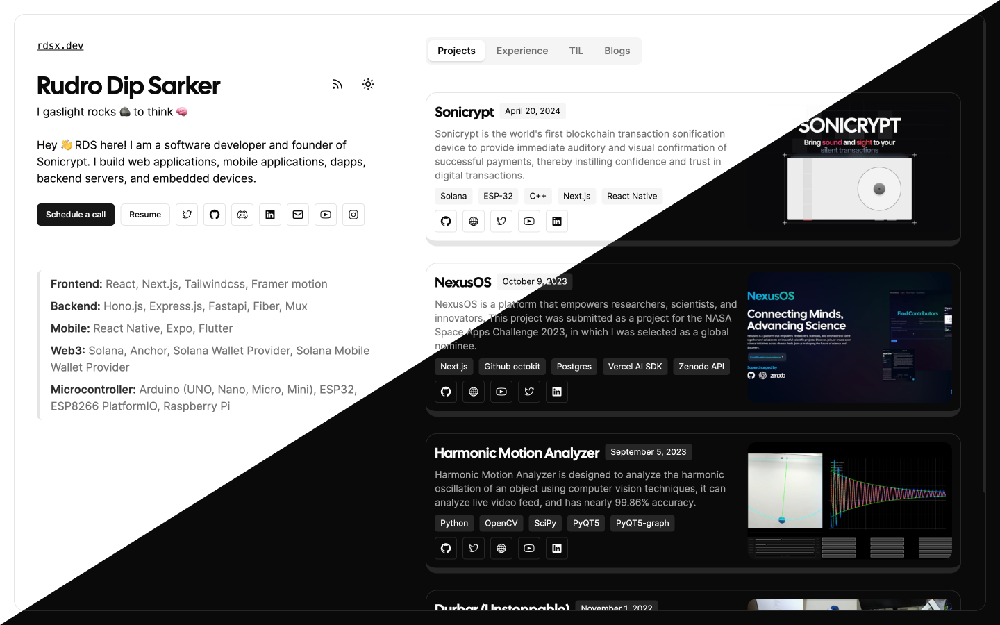

# Portfolio website template

## Demo

You can check the live demo of this website [rdsx.dev](https://rdsx.dev)

## Features

- MDX blog posts
- MDX projects & other content
- RSS feed for blog posts
- Both light and dark mode
- SEO friendly (scoring 100 on Lighthouse)
- Responsive design (mobile friendly)
- Sitemap generation
- Analytics integration

[pagespeed.web.dev <br />](https://pagespeed.web.dev/analysis/https-www-rdsx-dev/5dbg63wkcn?form_factor=desktop)

## Tech Stack

- **Language**: TypeScript
- **Framework**: Next 14 (app router)
- **Styling**: Tailwind CSS
- **Content**: MDX
- **Content Management**: Github
- **Content Generation**: [Velite](https://velite.js.org/)
- **RSS Generation**: [feed](https://github.com/jpmonette/feed)
- **Deployment**: Vercel
- **Analytics**: Vercel Analytics, Vercel Speed Analytics

I'm using a [view transition api library](https://github.com/shuding/next-view-transitions) for this website. It's a simple and lightweight library that provides a smooth transition between pages by [Shu Ding](https://x.com/shuding_)

## Development

```bash
# fork the repo & clone it
git clone https://github.com/your-username/rdsx.dev

# install dependencies
bun install

# run the development server
bun dev

# run velite dev server
bun velite dev
```

## Content Management

Configure `velite.config.ts` to add or modify your collection of content

Write your blog posts, projects, tils in the `content` directory.

```bash
 root
+├── content
+│   ├── blogs
+│   │   └── hello-world.mdx
+│   ├── projects
+│   │   └── project.mdx
+│   ├── tils
+│   │   └── til.mdx
+│   └── others
+│       └── other.yml
 ├── public
 ├── package.json
 └── velite.config.ts
```

Read the [velite docs](https://velite.js.org/guide/quick-start) for more information on how to use it.

## Personalization

- Configure website information in `src/config/site.config.ts`
- Configure personal information in `src/config/portfolio.config.ts`
- Configure experience information in `src/config/experience.config.ts`

## SEO Optimization

- Configure SEO information in `src/config/site.config.ts`
- Configure social media information in `src/config/site.config.ts` & `src/config/portfolio.config.ts`
- Configure blog post SEO generation in `src/app/blogs/[slug]/page.tsx`
- Configure page SEO generation in their respective pages in `src/app`
- Configure sitemap file in `src/app/sitemap.ts`.
- Configure browser crawlable routes in `src/app/robots.ts`.

## RSS generation

Configure rss feed generation script in `rss.ts`. You can update `description` and other parameters.

To generate rss feed, run the following command:

```bash
bun run rss:build
```

It will generate `rss.xml`, `rss.json` & `atom.xml` in your `public` directory.

Your default rss feed will be available at `/rss.xml` or `/rss.json` or `/atom.xml`.
To configure custom rss feed path, update `next.config.mjs` file. Currently, it's set to `/feed`.

```ts
const nextConfig = {
  // ...
  async rewrites() {
    return [
      {
        source: '/feed',
        destination: '/rss.xml',
      },
    ]
  },
  // ...
};
```

## Analytics Integration

I'm currently using Vercel Analytics and Vercel Speed Analytics for this website. It's very simple to integrate. You will find the integration code in `src/app/layout.tsx`.

```tsx
// ...
import { SpeedInsights } from "@vercel/speed-insights/next"
import { Analytics } from "@vercel/analytics/react"
// ...

export default function RootLayout(...) {
  return (
    <div>
      {/* ... */}
      <Analytics />
      <SpeedInsights />
      {/* ... */}
    </div>
  );
}
```

## Deployment

The easiest way to deploy this website is to use Vercel. You can deploy it with a single click using the button below:

[](https://vercel.com/new/clone?repository-url=https://github.com/rudrodip/rdsx.dev)

## License

[GNU AFFERO GENERAL PUBLIC LICENSE](LICENSE)
